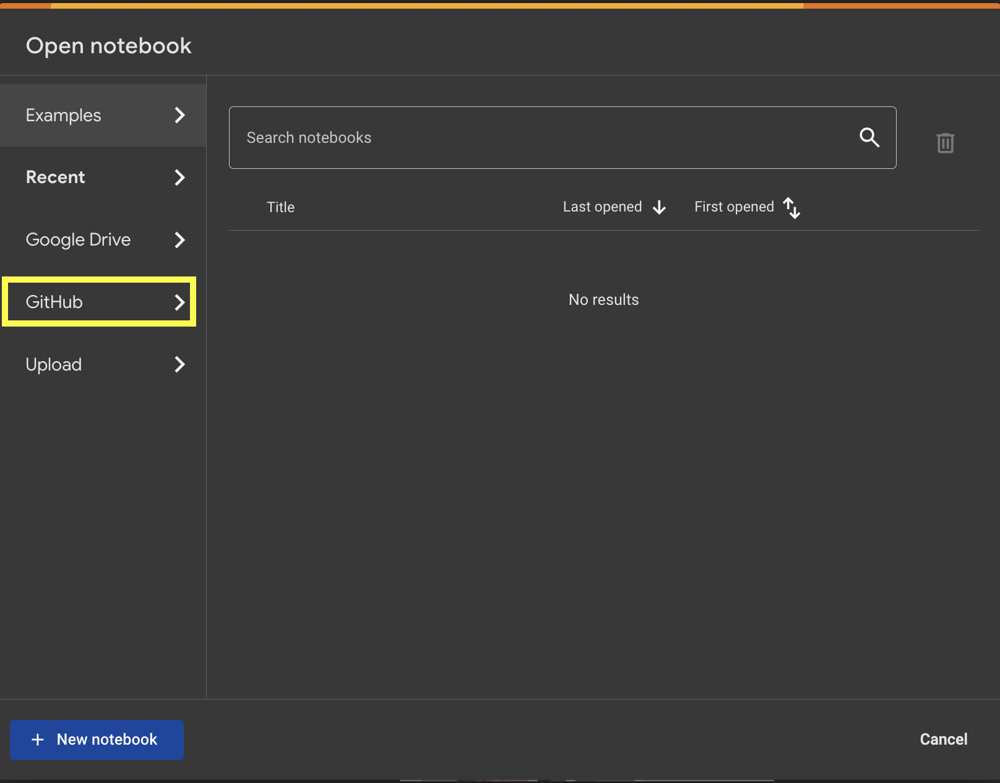
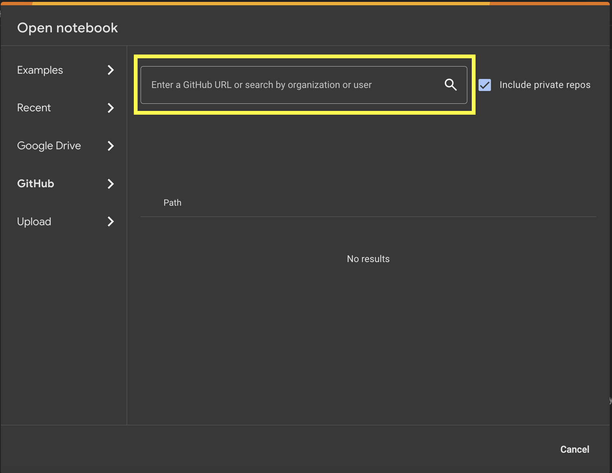

# PhysiCell Training Apps

This repository contains a collection of training apps for PhysiCell. Each app is a self-contained example that demonstrates a specific feature of PhysiCell. The apps are designed to be used in conjunction with the PhysiCell documentation and tutorials.

## Overview

PhysiCell is a flexible open source framework for building agent-based multicellular models in 3-D tissue environments.

Reference: A Ghaffarizadeh, R Heiland, SH Friedman, SM Mumenthaler, and P Macklin, PhysiCell: an Open Source Physics-Based Cell Simulator for Multicellular Systems, PLoS Comput. Biol. 14(2): e1005991, 2018. DOI: 10.1371/journal.pcbi.1005991

Visit http://MathCancer.org/blog for the latest tutorials and help.

Notable recognition:

- [2019 PLoS Computational Biology Research Prize for Public Impact](https://biologue.plos.org/2019/05/31/announcing-the-winners-of-the-2019-plos-computational-biology-research-prize/)

## Installation

No installation is required. All apps utlitze Google Colab, which is a free cloud-based Jupyter notebook environment. To run an app, you may simply copy the URL of the app and paste it into the Colab notebook URL field, specifically the Github option, highlighted in yellow.

### Apps

1. [Basic Cell Mechanics](tr_Mechanics)
2. [Cell Microenviroment Models](tr_Microenvironment)
3. [Cell Motility Models](tr_Motility)
4. [Cell Secretion Models](tr_Secretion)
5. [Cell Volumes Models](tr_Volume)
6. [Cell Death Models](tr_Death)

## Links

You are also welcome to clone each app to your local machine and run it on Colab from your Google Drive.
